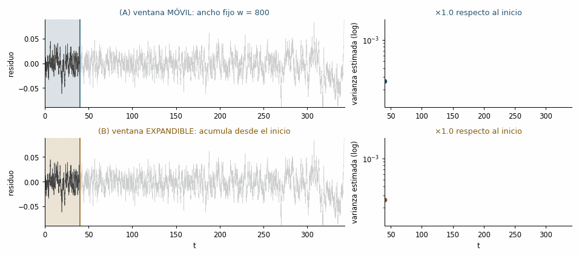



::: {.objetivos}
**Objetivos de aprendizaje**

- Estimar varianza y autocorrelación en **ventanas móviles** sobre una serie real o simulada.
- Distinguir **ventana móvil** de **ventana expandible**, implementar ambas y saber cuándo falla cada una.
- Aplicar *detrending* y cuantificar la tendencia del indicador con el **$\tau$ de Kendall**.
- Reportar **sensibilidad** al tamaño de ventana y conocer la lógica de los *surrogates*.
- Reproducir todo el flujo con `ewstools` en tu propia máquina.
:::

## Un sistema que deriva hacia el pliegue {#sec-deriva}

A diferencia del capítulo anterior (donde fijábamos $\lambda$), ahora el parámetro de control **cambia lentamente** y empuja al sistema hacia una saddle-node. Simulamos el doble pozo con forzamiento creciente, detenemos en la transición y calculamos las EWS sobre el tramo **pre-transición**:

```{pyodide}
import numpy as np, matplotlib.pyplot as plt
from scipy.ndimage import gaussian_filter1d
from scipy.stats import kendalltau

rng = np.random.default_rng(1)
def f(x, h): return -x**3 + x + h

T, dt, sigma = 400.0, 0.05, 0.04
n = int(T/dt)
h = np.linspace(-0.2, 0.6, n)          # rampa lenta hacia el pliegue (h_c ≈ 0.385)
x = np.empty(n); x[0] = -1.0
for t in range(1, n):
    x[t] = x[t-1] + dt*f(x[t-1], h[t-1]) + sigma*np.sqrt(dt)*rng.standard_normal()

trans = int(np.argmax(x > 0))          # primer salto al otro pozo
pre = x[:trans]

# 1) detrending gaussiano (el mismo que usa ewstools por omisión)
resid = pre - gaussian_filter1d(pre, 200, mode="nearest")

# 2) EWS en ventana deslizante
def ac1(s):
    s = s - s.mean(); return np.corrcoef(s[:-1], s[1:])[0, 1]

w = 800
idx = range(w, len(resid))
var_roll = np.array([resid[i-w:i].var()  for i in idx])
ac_roll  = np.array([ac1(resid[i-w:i])   for i in idx])
tt = np.arange(w, len(resid)) * dt

fig, ax = plt.subplots(3, 1, figsize=(6.6, 6), sharex=True)
ax[0].plot(np.arange(trans)*dt, pre, lw=.5, color="#444"); ax[0].set_ylabel("x(t)")
ax[0].set_title("Serie pre-transición")
ax[1].plot(tt, var_roll, color="#1f5673"); ax[1].set_ylabel("varianza móvil")
ax[2].plot(tt, ac_roll,  color="#b03a2e"); ax[2].set_ylabel("AC(1) móvil"); ax[2].set_xlabel("t")
plt.tight_layout(); plt.show()

print("Kendall τ (varianza):", round(kendalltau(tt, var_roll)[0], 3))
print("Kendall τ (AC de retardo-1):", round(kendalltau(tt, ac_roll)[0], 3))
```

Ambos indicadores **tienden a subir** antes del salto, y el $\tau$ de Kendall (cercano a $+1$) lo confirma como una **tendencia monótona creciente**: la huella estadística de la ralentización crítica.

::: {.callout-note}
## Un detalle que sí importa: cómo se quita la tendencia
El *detrending* aquí es un **filtro gaussiano** (`gaussian_filter1d`), no una media móvil con `np.convolve(..., mode="same")`. La diferencia no es cosmética: la convolución en modo `same` divide entre el ancho completo de la ventana también en los extremos, donde hay menos puntos, así que **subestima la tendencia al principio y al final** de la serie y deja residuos artificialmente grandes justo donde vamos a buscar la señal. Con `mode="nearest"` el filtro extiende la serie con su valor de borde y ese sesgo desaparece. Es exactamente el tipo de decisión de preprocesamiento que hay que reportar y someter a análisis de sensibilidad [@alvarez2026early, sec. 3.1.4].
:::

## Ventana móvil y ventana expandible {#sec-ventanas}

Todo indicador EWS se calcula **re-estimando un estadístico sobre segmentos sucesivos** de la serie. Hay dos maneras de elegir esos segmentos, y no son equivalentes [@alvarez2026early, sec. 3.1.1]:

- **Ventana móvil (deslizante, *rolling*).** Se fija un ancho $w$ y se desliza: en cada tiempo $t$ el indicador se calcula con $\{x_{t-w+1},\dots,x_t\}$. Imita el **monitoreo prospectivo en tiempo real**: solo usa las $w$ observaciones más recientes y **descarta** las viejas, que pueden pertenecer a otro régimen dinámico.
- **Ventana expandible (acumulativa, *expanding*).** La ventana **crece**: el indicador en $t$ se calcula con $\{x_1,\dots,x_t\}$ (o desde un punto fijo tras un periodo de calentamiento). Al acumular más datos, **reduce la varianza del estimador** y da curvas más estables, sobre todo al principio del monitoreo, cuando una ventana móvil tendría muy pocos puntos.

El precio de la ventana expandible es serio: si el sistema pasa por fases (una meseta estable larga y luego un forzamiento tardío), las observaciones antiguas **diluyen** la aceleración reciente del indicador y pueden enmascararla por completo.

{fig-alt="Animación de cuatro paneles: arriba una ventana de ancho fijo se desliza sobre los residuos y su varianza estimada crece con fuerza al final; abajo una ventana que crece desde el inicio produce una varianza mucho más aplanada." width="100%"}

*__Figura 4.__ Las dos estrategias de ventana sobre la misma serie. Arriba: ventana móvil de ancho fijo $w$. Abajo: ventana expandible que acumula desde el inicio. A la derecha, el indicador (varianza, escala logarítmica) que produce cada una, con la amplificación respecto a su valor inicial. Reconstrucción de la figura 3 de @alvarez2026early.*

Vamos a medirlo. El escenario es **multifase**, que es el caso realista y el que separa a las dos estrategias: el sistema pasa el primer 35 % del tiempo con el parámetro **quieto** y solo después empieza la rampa hacia el pliegue.

::: {.panel-tabset}

## Python

```{pyodide}
import numpy as np, matplotlib.pyplot as plt
from scipy.ndimage import gaussian_filter1d
from scipy.stats import kendalltau

def f(x, h): return -x**3 + x + h
def fijos(h):
    r = np.roots([-1, 0, 1, h]); return np.sort(r[np.abs(r.imag) < 1e-6].real)
def ac1(s):
    s = s - s.mean(); return np.corrcoef(s[:-1], s[1:])[0, 1]

# --- serie multifase: meseta estable y luego rampa hacia el pliegue ---
dt, sigma, n = 0.05, 0.035, 8000
h = np.concatenate([np.full(int(.35*n), -0.2),
                    np.linspace(-0.2, 0.6, n - int(.35*n))])
rng = np.random.default_rng(4)
x = np.empty(n); x[0] = fijos(h[0])[0]        # arrancamos en el pozo izquierdo
for t in range(1, n):
    x[t] = x[t-1] + dt*f(x[t-1], h[t-1]) + sigma*np.sqrt(dt)*rng.standard_normal()
pre = x[:int(np.argmax(x > 0)) - 30]
resid = pre - gaussian_filter1d(pre, 200, mode="nearest")

# --- las dos ventanas, sobre exactamente los mismos residuos ---
w = 800                                    # ancho de la móvil / calentamiento de la expandible
idx = np.arange(w, len(resid))

var_movil = np.array([resid[i-w:i].var() for i in idx])   # ventana FIJA que se desliza
var_expan = np.array([resid[:i].var()    for i in idx])   # ventana que CRECE desde 0
ac_movil  = np.array([ac1(resid[i-w:i])  for i in idx])
ac_expan  = np.array([ac1(resid[:i])     for i in idx])
tt = idx * dt

fig, ax = plt.subplots(2, 1, figsize=(6.8, 5), sharex=True)
ax[0].plot(tt, var_movil, color="#1f5673", label="móvil (w fija)")
ax[0].plot(tt, var_expan, color="#8a5a00", label="expandible")
ax[0].set_yscale("log"); ax[0].set_ylabel("varianza"); ax[0].legend()
ax[1].plot(tt, ac_movil, color="#1f5673"); ax[1].plot(tt, ac_expan, color="#8a5a00")
ax[1].set_ylabel("AC(1)"); ax[1].set_xlabel("t")
plt.tight_layout(); plt.show()

print(f"{'indicador':<12}{'ventana':<14}{'tau Kendall':>12}{'amplificacion':>15}")
for nom, mo, ex in [("varianza", var_movil, var_expan), ("AC(1)", ac_movil, ac_expan)]:
    for etq, s in [("móvil", mo), ("expandible", ex)]:
        print(f"{nom:<12}{etq:<14}{kendalltau(tt, s)[0]:12.2f}{s[-1]/s[0]:14.1f}x")
```

## R

```{webr}
f <- function(x, h) -x^3 + x + h
fijos <- function(h) { r <- polyroot(c(h, 1, 0, -1)); sort(Re(r[abs(Im(r)) < 1e-6])) }
ac1 <- function(s) { s <- s - mean(s); cor(s[-length(s)], s[-1]) }

# --- serie multifase: meseta estable y luego rampa hacia el pliegue ---
dt <- 0.05; sigma <- 0.035; n <- 8000
h <- c(rep(-0.2, floor(.35*n)), seq(-0.2, 0.6, length.out = n - floor(.35*n)))
set.seed(4); x <- numeric(n); x[1] <- fijos(h[1])[1]
for (t in 2:n) x[t] <- x[t-1] + dt*f(x[t-1], h[t-1]) + sigma*sqrt(dt)*rnorm(1)
pre <- x[1:(which(x > 0)[1] - 30)]

# detrending gaussiano (equivale a gaussian_filter1d con mode = "nearest")
suavizado <- function(y, bw) {
  k <- round(3*bw); d <- (-k):k
  peso <- exp(-d^2/(2*bw^2)); peso <- peso/sum(peso)
  yp <- c(rep(y[1], k), y, rep(y[length(y)], k))        # bordes: valor extremo
  as.vector(stats::filter(yp, peso, sides = 2))[(k+1):(k+length(y))]
}
resid <- pre - suavizado(pre, 200)

# --- las dos ventanas, sobre exactamente los mismos residuos ---
w <- 800                                  # ancho de la móvil / calentamiento de la expandible
idx <- seq(w + 1, length(resid), by = 25) # avanzamos de 25 en 25: más rápido en el navegador
var_movil <- sapply(idx, function(i) var(resid[(i-w+1):i]))   # ventana FIJA que se desliza
var_expan <- sapply(idx, function(i) var(resid[1:i]))         # ventana que CRECE desde 0
ac_movil  <- sapply(idx, function(i) ac1(resid[(i-w+1):i]))
ac_expan  <- sapply(idx, function(i) ac1(resid[1:i]))
tt <- idx * dt

op <- par(mfrow = c(2, 1), mar = c(4, 4, 2, 1))
plot(tt, var_movil, type = "l", col = "#1f5673", log = "y", lwd = 2,
     xlab = "", ylab = "varianza", ylim = range(c(var_movil, var_expan)))
lines(tt, var_expan, col = "#8a5a00", lwd = 2)
legend("topleft", c("móvil (w fija)", "expandible"), col = c("#1f5673", "#8a5a00"),
       lwd = 2, bty = "n")
plot(tt, ac_movil, type = "l", col = "#1f5673", lwd = 2, xlab = "t", ylab = "AC(1)",
     ylim = range(c(ac_movil, ac_expan)))
lines(tt, ac_expan, col = "#8a5a00", lwd = 2)
par(op)

for (par_ in list(list("varianza", var_movil, var_expan), list("AC(1)", ac_movil, ac_expan))) {
  for (k in 2:3) {
    s <- par_[[k]]; etq <- c("móvil", "expandible")[k - 1]
    cat(sprintf("%-10s %-12s tau = %+5.2f   amplificacion = %4.1fx\n",
                par_[[1]], etq, cor(tt, s, method = "kendall"), s[length(s)] / s[1]))
  }
}
```

:::

El resultado es el que hay que retener: **el $\tau$ de Kendall no distingue las dos ventanas —puede incluso salir más alto en la expandible— pero la sensibilidad sí las distingue**. La varianza en ventana móvil se multiplica por ~5 desde el inicio hasta el borde de la transición; la expandible, apenas por ~1.7 (prueba también la pestaña de R: los números cambian con la realización, la conclusión no). Como el $\tau$ solo mide **monotonía**, premia a la curva expandible por ser suave y no penaliza que haya **diluido** la aceleración tardía. Dos lecciones:

1. **Nunca resumas un indicador solo con $\tau$.** Reporta también la magnitud del cambio y mira la curva.
2. **Para detectar una transición inminente, la ventana móvil suele ganar** [@alvarez2026early, sec. 3.1.1]. La expandible es útil para estimar un **nivel de base** estable al inicio del monitoreo, o combinada con pesos que favorezcan lo reciente.

::: {.callout-note collapse="true"}
## El traslape entre ventanas y el número de puntos independientes [Avanzado]{.avanzado-tag}
Arriba avanzamos la ventana **de un punto en un punto**: traslape máximo. Eso da la curva más suave y la mejor resolución temporal, pero introduce una **autocorrelación fortísima en la serie del indicador**, que viola el supuesto de independencia de las pruebas de tendencia e **infla la significancia** [@alvarez2026early, sec. 3.1.2]. Ventanas sin traslape eliminan ese problema pero dejan poquísimos puntos. El compromiso habitual es avanzar $w/4$ o $w/2$:

```{pyodide}
paso = w // 4                                  # avanzar w/4 en lugar de 1
idx2 = np.arange(w, len(resid), paso)
var2 = np.array([resid[i-w:i].var() for i in idx2])
print(f"traslape máximo: {len(idx)} puntos  |  paso w/4: {len(idx2)} puntos")
print("tau con paso w/4:", round(kendalltau(idx2*dt, var2)[0], 3))
```

Y ojo con la convención de fijar $w = N/2$: con series cortas y paso $w/2$ quedan **dos o tres ventanas**, con las que ninguna prueba de tendencia tiene poder estadístico.
:::

## Cuánta ventana es suficiente: análisis de sensibilidad {#sec-sensibilidad}

No existe un $w$ correcto. La guía empírica es que $w$ debe ser **grande** para estimar bien varianza o autocorrelación (al menos 30–50 observaciones) y **pequeño** frente a la escala de tiempo de la transición hipotética. Por eso la buena práctica no es elegir un $w$ y callar, sino **barrer** un rango y reportar el resultado completo [@alvarez2026early, sec. 3.2.3; @dakos2012ews]:

```{pyodide}
print(f"{'w':>6}{'tau(var)':>11}{'tau(AC1)':>11}{'n ventanas':>13}")
for w_ in [200, 400, 800, 1600, 3000]:
    if w_ >= len(resid): continue
    ii = np.arange(w_, len(resid))
    v = np.array([resid[i-w_:i].var() for i in ii])
    a = np.array([ac1(resid[i-w_:i])  for i in ii])
    t_ = ii*dt
    print(f"{w_:6d}{kendalltau(t_, v)[0]:11.2f}{kendalltau(t_, a)[0]:11.2f}{len(ii):13d}")
```

Si el signo y el orden de magnitud del $\tau$ **sobreviven** al barrido, la señal es robusta. Si aparecen y desaparecen según la ventana, lo honesto es decirlo.

## Buenas prácticas y trampas {#sec-practicas}

- **Detrending.** Hay que separar la **deriva lenta** de las fluctuaciones. Filtro gaussiano, LOESS o media móvil son habituales; la elección **afecta** el resultado [@dakos2012ews]. El ancho de banda debe quitar tendencia y estacionalidad sin borrar las fluctuaciones de alta frecuencia que llevan la señal. La **primera diferencia** ($\Delta x_t$) elimina tendencias lineales pero **distorsiona la autocorrelación**, así que es mala idea aquí [@alvarez2026early, sec. 3.1.4].
- **Estacionalidad.** Con datos estacionales (casi todo dato ecológico de campo), hay que desestacionalizar antes: descomposición clásica, STL, o modelos de espacio de estados.
- **Tamaño y tipo de ventana.** Ver @sec-ventanas y @sec-sensibilidad: reporta el barrido, no un solo número.
- **Indicadores complementarios.** La **asimetría** (*skewness*) y la **curtosis** suelen crecer al deformarse el pozo; el espectro se **enrojece** (más potencia en bajas frecuencias); el *flickering* y la **bimodalidad** aparecen en sistemas biestables cerca del pliegue. Ninguno es informativo en todos los mecanismos: *flickering* y bimodalidad **solo** tienen sentido bajo B-tipping, mientras que el enrojecimiento espectral puede aparecer por variabilidad ambiental creciente sin bifurcación alguna [@alvarez2026early, sec. 2.4].
- **Significancia con *surrogates*.** Para decidir si una tendencia es real, se compara contra series **subrogadas** (p. ej. con la misma autocorrelación o el mismo espectro, pero con la estructura temporal destruida) y se construye una distribución nula del $\tau$.
- **Sesgo retrospectivo.** Si solo analizas series que **ya sabes** que terminaron en transición, los indicadores tienden a salir positivos aunque no haya habido pérdida de resiliencia: es sesgo de muestreo condicional. Estimar la tasa de falsos positivos exige mirar también sistemas que **no** transitaron [@alvarez2026early, sec. 3.2.2; @boettiger2012].

::: {.callout-note}
## En tu máquina: `ewstools` (Python) y `EWSmethods` (R) {#sec-ewstools-cap}
En el navegador computamos las EWS "a mano" para que se vea la mecánica. En un flujo real conviene usar bibliotecas dedicadas. Este bloque **no se ejecuta aquí**; cópialo a tu entorno local (versión completa en el [apéndice B](apB-recetario.qmd#sec-ewstools)):

```python
# Python (local):  pip install ewstools
import numpy as np, pandas as pd, ewstools

ts = ewstools.TimeSeries(data=pre)          # pre = tramo anterior a la transición
ts.detrend(method="Gaussian", bandwidth=0.2)   # bandwidth como fracción de la serie
ts.compute_var(rolling_window=0.25)            # 0.25 = w es el 25 % de la serie
ts.compute_auto(rolling_window=0.25, lag=1)
ts.compute_skew(rolling_window=0.25)
ts.compute_ktau()
print(ts.ktau)                                  # {'variance': .., 'ac1': .., 'skew': ..}
ts.make_plotly().show()                         # figura interactiva

# ewstools SOLO implementa ventana móvil. La expandible se obtiene en una línea
# sobre los mismos residuos que ya calculó:
res = ts.state["residuals"]
var_expandible = res.expanding(min_periods=int(0.25*len(res))).var()
ac_expandible  = res.expanding(min_periods=int(0.25*len(res))).apply(
                     lambda s: pd.Series(s).autocorr(lag=1), raw=False)
```

```r
# R (local)
library(EWSmethods)
res <- uniEWS(data = cbind(tiempo, serie), metrics = c("SD","ar1","skew"),
              method = "rolling", winsize = 50)   # winsize en % de la serie
plot(res)
```
:::

## Ejercicios {#sec-ej6}

::: {.callout-tip}
## Ejercicio 7.1 — Sensibilidad a la ventana
Cambia `w` a `400` y luego a `1500` en la primera celda. ¿Cómo afectan el ruido del indicador y el valor del $\tau$ de Kendall? Compara con la tabla de @sec-sensibilidad.

::: {.callout-note collapse="true"}
## Solución
Con `w=400` las curvas de varianza/AC son más ruidosas y el $\tau$ puede bajar; con `w=1500` son más suaves pero la señal aparece más tarde y se pierde resolución cerca de la transición. No hay ventana "correcta": por eso se reporta el barrido completo.
:::
:::

::: {.callout-tip}
## Ejercicio 7.2 — ¿Y si no hay transición?
Pon `sigma=0.04` y `h = np.linspace(-0.2, 0.2, n)` (la rampa **no** alcanza el pliegue) en la primera celda. ¿Siguen subiendo los indicadores? ¿Qué dice esto sobre falsos positivos?

::: {.callout-note collapse="true"}
## Solución
Sin acercarse al pliegue, varianza y AC(1) se mantienen aproximadamente planas y el $\tau$ ronda 0. Esto ilustra que una **tendencia creciente** es la señal informativa; observar valores altos pero estables no implica transición inminente (cuidado con los falsos positivos, @boettiger2012).
:::
:::

::: {.callout-tip}
## Ejercicio 7.3 — Meseta más larga, dilución mayor
En la celda de @sec-ventanas cambia la meseta de `.35` a `.15` y luego a `.60` (la fracción de la serie con el parámetro quieto). Anota la amplificación de la varianza con cada ventana. ¿Qué le pasa a la ventaja de la ventana móvil?

::: {.callout-note collapse="true"}
## Solución
Cuanto más larga la meseta, más datos "de régimen estable" acumula la ventana expandible y más diluye el ascenso final: su amplificación se acerca a 1 mientras la de la móvil se mantiene. Con meseta corta (`.15`) las dos estrategias casi coinciden, porque casi toda la serie pertenece ya a la fase de aproximación. La ventaja de la móvil crece exactamente con el grado de **no monotonía** del cambio.
:::
:::

::: {.callout-tip}
## Ejercicio 7.4 — Ruido creciente, falso positivo garantizado
Modifica la serie multifase para que $h$ **no** cambie (`h = np.full(n, -0.2)`) pero $\sigma$ crezca linealmente de `0.02` a `0.06` (usa `sig = np.linspace(0.02, 0.06, n)` dentro del bucle). Calcula el $\tau$ de la varianza y de la AC(1) en ventana móvil. ¿Cuál de los dos indicadores te engaña?

::: {.callout-note collapse="true"}
## Solución
La **varianza** sube con fuerza y da un $\tau$ claramente positivo: es el falso positivo por ruido creciente [@alvarez2026early, sec. 2.6.2]. La **AC(1)** se mantiene aproximadamente plana, porque $\rho_1 = e^{-\lambda \Delta t}$ no depende de $\sigma$: la tasa de retorno no cambió. Ese contraste es un diagnóstico útil en la práctica: una varianza que sube **sin** que suba la autocorrelación apunta a variabilidad externa creciente, no a pérdida de resiliencia.
:::
:::

## Para seguir

El [capítulo 8](p3-cap07-ews-multivariadas-ml.qmd) generaliza a sistemas con **muchas variables** y presenta los enfoques de **aprendizaje automático**.
