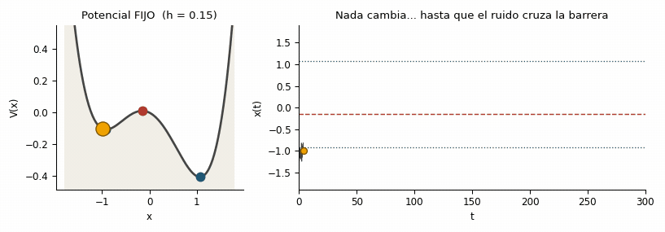
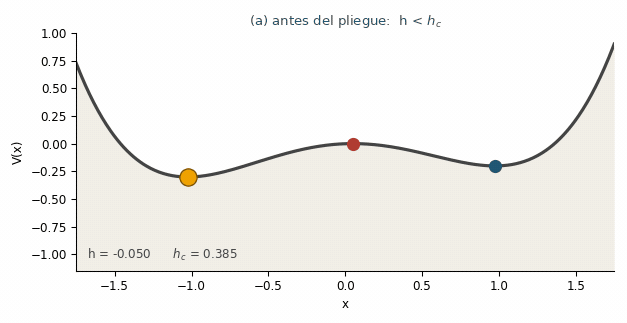
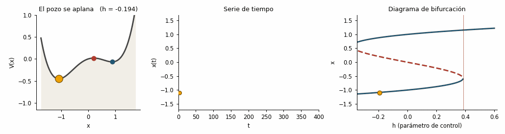



::: {.objetivos}
**Objetivos de aprendizaje**

- Distinguir los cuatro mecanismos por los que un sistema puede cruzar un punto de no retorno: **bifurcación**, **ruido**, **tasa** y **choque**.
- Leer el **paisaje de potencial** antes, en y después del pliegue, y ver cómo la **canica** lo recorre.
- Anticipar **cuándo** las señales de alerta temprana funcionan y cuándo no tienen nada que detectar.
:::

## Un mismo salto, mecanismos distintos {#sec-mecanismos}

Toda la Parte III descansa sobre un supuesto que conviene hacer explícito desde el principio: que la transición ocurre porque **el sistema pierde estabilidad**. No es la única forma de saltar de un estado a otro, y la diferencia decide si las EWS sirven o no [@alvarez2026early].

El modelo de trabajo de este capítulo es el doble pozo del [capítulo 3](p1-cap03-potenciales-catastrofe.qmd) con ruido aditivo:

$$
dx = f(x)\,dt + \sigma\,dB, \qquad f(x) = -x^3 + x + h ,
$$ {#eq-sde-doblepozo}

cuyo paisaje de potencial (recuerda $f = -dV/dx$) es

$$
V(x) = \frac{x^4}{4} - \frac{x^2}{2} - h\,x .
$$ {#eq-V-doblepozo}

Aquí hay **dos perillas** independientes:

- $h$, el **parámetro de control**, que inclina el paisaje y puede llegar a destruir un pozo;
- $\sigma$, la **intensidad del ruido**, que sacude a la canica dentro del pozo sin cambiar el paisaje.

Siguiendo la clasificación de Ashwin et al. [@ashwin2012], ampliada con el choque en la tipología de @alvarez2026early [sec. 2.6], mover cada perilla —o no mover ninguna— da un mecanismo de *tipping* distinto:

| Mecanismo | Qué cambia | ¿Ralentización crítica? | ¿EWS clásicas? |
|---|---|---|---|
| **Inducido por bifurcación** (*B-tipping*) | $h$ cruza $h_c$: el pozo desaparece | Sí, $\lambda \to 0$ | Sí |
| **Inducido por ruido** (*N-tipping*) | Nada; $\sigma$ empuja sobre la barrera | No | Prácticamente no |
| **Inducido por la tasa** (*R-tipping*) | $h$ cambia demasiado **rápido** | Ausente | No |
| **Inducido por choque** (*S-tipping*) | Una perturbación única y enorme | Ausente | No (solo diagnóstico *a posteriori*) |

: Los cuatro mecanismos de *tipping* y la firma que dejan (o no) en la serie de tiempo. {.striped tbl-colwidths="[24,30,23,23]"}

Las tres figuras que siguen reconstruyen la distinción entre los dos primeros, que son los que se pueden simular con @eq-sde-doblepozo moviendo una sola perilla.

::: {.callout-note}
## Sobre estas figuras
Cada figura viene en **tres formatos**: una **animación** que se ve de inmediato, un **panel interactivo** donde tú mueves las perillas, y el **código ejecutable** (Python y R) que la genera. Están **reconstruidas desde cero**, siguiendo la exposición de las figuras 1–3 de Eirik Myrvoll-Nilsen, [*Early warning signals*](https://eirikmyrvollnilsen.com/research/earlywarning/) (material asociado a @myrvoll2025bayesian), y la figura 1 de @alvarez2026early.

Convención de color en todo el capítulo: **azul** = punto fijo estable, **rojo** = punto fijo inestable (el *punto de tipping*), **ámbar** = el estado del sistema (la "canica").
:::

```{ojs}
//| echo: false
//| output: false
// ---------------------------------------------------------------------------
// Núcleo compartido de los widgets interactivos (capítulo "Tipos de transición")
// Se escribe con la sintaxis de celdas de Observable (nombre = valor).
// ---------------------------------------------------------------------------

COL = ({azul: "#1f5673", rojo: "#b03a2e", gris: "#444444", oro: "#f0a202",
        arena: "#e8e2d5", claro: "#c9ced2"})

hc = 2 / Math.sqrt(27)

f = (x, h) => -x * x * x + x + h

V = (x, h) => x ** 4 / 4 - x ** 2 / 2 - h * x

// raíces reales de f(x) = 0, ordenadas de menor a mayor
puntosFijos = (h) => {
  if (Math.abs(h) < hc) {
    const a = Math.acos(1.5 * Math.sqrt(3) * h) / 3;
    return [0, 1, 2]
      .map(k => (2 / Math.sqrt(3)) * Math.cos(a - 2 * Math.PI * k / 3))
      .sort((p, q) => p - q);
  }
  const s = Math.sqrt(h * h / 4 - 1 / 27);
  return [Math.cbrt(h / 2 + s) + Math.cbrt(h / 2 - s)];
}

// generador normal reproducible (mulberry32 + Box–Muller)
ruidoNormal = (semilla) => {
  let a = semilla >>> 0;
  const u = () => {
    a = (a + 0x6D2B79F5) >>> 0;
    let t = a;
    t = Math.imul(t ^ (t >>> 15), t | 1);
    t ^= t + Math.imul(t ^ (t >>> 7), t | 61);
    return ((t ^ (t >>> 14)) >>> 0) / 4294967296;
  };
  return () => Math.sqrt(-2 * Math.log(u() + 1e-12)) * Math.cos(2 * Math.PI * u());
}

// Euler–Maruyama sobre dx = f(x,h) dt + sigma dB, con h en rampa de h0 a h1
simula = ({h0, h1 = null, sigma, dt, n, semilla = 1}) => {
  const z = ruidoNormal(semilla);
  const hf = h1 === null ? h0 : h1;
  const hs = new Float64Array(n);
  const x = new Float64Array(n);
  for (let i = 0; i < n; i++) hs[i] = h0 + (hf - h0) * i / (n - 1);
  x[0] = puntosFijos(hs[0])[0];
  for (let i = 1; i < n; i++) {
    x[i] = x[i - 1] + dt * f(x[i - 1], hs[i - 1]) + sigma * Math.sqrt(dt) * z();
    if (!isFinite(x[i]) || Math.abs(x[i]) > 4) x[i] = Math.sign(x[i]) * 4;
  }
  return {x, hs, dt};
}

// primer cruce del punto fijo inestable (o null si no hay salto)
indiceSalto = (x, umbral) => {
  for (let i = 0; i < x.length; i++) if (x[i] > umbral) return i;
  return null;
}

// adelgaza una serie para dibujarla sin penalizar el navegador
muestrea = (x, dt, hasta, maxPuntos = 1200) => {
  const paso = Math.max(1, Math.ceil(hasta / maxPuntos));
  const out = [];
  for (let i = 0; i < hasta; i += paso) out.push({t: i * dt, x: x[i]});
  return out;
}

// --- gráficas -------------------------------------------------------------

curvaPotencial = (h) => {
  const out = [];
  for (let i = 0; i <= 240; i++) {
    const x = -1.8 + 3.6 * i / 240;
    out.push({x, v: V(x, h), piso: -1.3});
  }
  return out;
}

// pequeño encabezado propio: evita que el tema del curso estilice el <h2>
// que Plot genera con la opción `title`
conTitulo = (nodo, texto) => {
  const caja = document.createElement("div");
  const t = document.createElement("div");
  t.textContent = texto;
  t.style = "font:600 13px/1.35 system-ui,sans-serif;color:#444;margin:0 0 .25rem .5rem";
  caja.append(t, nodo);
  return caja;
}

panelPotencial = (h, canica, {ancho = 300, titulo = ""} = {}) => {
  const r = puntosFijos(h);
  const estables = (r.length === 3 ? [r[0], r[2]] : [r[0]]).map(x => ({x, v: V(x, h)}));
  const inestables = (r.length === 3 ? [r[1]] : []).map(x => ({x, v: V(x, h)}));
  return conTitulo(Plot.plot({
    width: ancho, height: 215, marginLeft: 42, marginBottom: 32,
    x: {label: "x", domain: [-1.8, 1.8]},
    y: {label: "V(x)", domain: [-1.3, 1.0]},
    marks: [
      Plot.areaY(curvaPotencial(h), {x: "x", y1: "piso", y2: "v", fill: COL.arena}),
      Plot.line(curvaPotencial(h), {x: "x", y: "v", stroke: COL.gris, strokeWidth: 2}),
      Plot.dot(estables, {x: "x", y: "v", fill: COL.azul, r: 5}),
      Plot.dot(inestables, {x: "x", y: "v", fill: COL.rojo, r: 5}),
      canica === null ? null
        : Plot.dot([{x: canica, v: V(canica, h)}],
                   {x: "x", y: "v", fill: COL.oro, stroke: "#7a5200", r: 8})
    ]
  }), titulo);
}

panelSerie = (datos, {ancho = 440, umbral = null, ymin = -1.9, ymax = 1.9,
                      titulo = "", tmax = null, color = null, corte = null} = {}) => {
  const ultimo = datos.length ? [datos[datos.length - 1]] : [];
  return conTitulo(Plot.plot({
    width: ancho, height: 215, marginLeft: 42, marginBottom: 32,
    x: {label: "t", domain: tmax === null ? undefined : [0, tmax]},
    y: {label: "x(t)", domain: [ymin, ymax]},
    marks: [
      umbral === null ? null
        : Plot.ruleY([umbral], {stroke: COL.rojo, strokeDasharray: "5 4"}),
      corte === null ? null
        : Plot.ruleX([corte], {stroke: COL.rojo, strokeOpacity: .45}),
      Plot.line(datos, {x: "t", y: "x", stroke: color || COL.gris, strokeWidth: 0.7}),
      Plot.dot(ultimo, {x: "t", y: "x", fill: COL.oro, stroke: "#7a5200", r: 5})
    ]
  }), titulo);
}

// ramas de equilibrio para el diagrama de bifurcación
ramasEquilibrio = () => {
  const est = [], ines = [];
  for (let i = 0; i <= 400; i++) {
    const h = -0.6 + 1.2 * i / 400;
    const r = puntosFijos(h);
    if (r.length === 3) {
      est.push({h, x: r[0], rama: "inferior"});
      est.push({h, x: r[2], rama: "superior"});
      ines.push({h, x: r[1]});
    } else {
      est.push({h, x: r[0], rama: r[0] > 0 ? "superior" : "inferior"});
    }
  }
  return {est, ines};
}

panelBifurcacion = (traza, hActual, xActual, {ancho = 380} = {}) => {
  const {est, ines} = ramasEquilibrio();
  return conTitulo(Plot.plot({
    width: ancho, height: 215, marginLeft: 42, marginBottom: 32,
    x: {label: "h (parámetro de control)", domain: [-0.45, 0.62]},
    y: {label: "x", domain: [-1.9, 1.9]},
    marks: [
      Plot.ruleX([hc], {stroke: COL.rojo, strokeOpacity: 0.5}),
      Plot.line(est, {x: "h", y: "x", z: "rama", stroke: COL.azul, strokeWidth: 2}),
      Plot.line(ines, {x: "h", y: "x", stroke: COL.rojo, strokeWidth: 2,
                       strokeDasharray: "5 4"}),
      Plot.line(traza, {x: "h", y: "x", stroke: COL.gris, strokeWidth: 0.7}),
      hActual === null ? null
        : Plot.dot([{h: hActual, x: xActual}],
                   {x: "h", y: "x", fill: COL.oro, stroke: "#7a5200", r: 5})
    ]
  }), "Diagrama de bifurcación");
}

// --- reproductor (play / pausa + barra de tiempo) --------------------------

reproductor = (n, {retardo = 90, autoplay = true, etiqueta = "cuadro"} = {}) => {
  const form = html`<form style="font:13px/1.4 system-ui,sans-serif;display:flex;align-items:center;gap:.6rem;margin:.3rem 0">
    <button name="b" type="button" style="width:6.2em;cursor:pointer">▶ play</button>
    <input name="i" type="range" min="0" max="${n - 1}" value="0" step="1" style="flex:1">
    <output name="o" style="min-width:6.5em;color:#444"></output>
  </form>`;
  let intervalo = null;
  const paso = () => {
    form.i.valueAsNumber = (form.i.valueAsNumber + 1) % n;
    form.i.dispatchEvent(new CustomEvent("input", {bubbles: true}));
  };
  const pintar = () => {
    form.value = form.i.valueAsNumber;
    form.o.value = `${etiqueta} ${form.i.valueAsNumber + 1}/${n}`;
  };
  form.i.oninput = (ev) => {
    if (ev && ev.isTrusted && intervalo) form.b.onclick();
    pintar();
  };
  form.b.onclick = () => {
    if (intervalo) {
      clearInterval(intervalo); intervalo = null;
      form.b.textContent = "▶ play";
    } else {
      intervalo = setInterval(paso, retardo);
      form.b.textContent = "❚❚ pausa";
    }
  };
  const vigila = setInterval(() => {
    if (!form.isConnected) {
      if (intervalo) clearInterval(intervalo);
      clearInterval(vigila);
    }
  }, 3000);
  pintar();
  if (autoplay) form.b.onclick();
  return form;
}

// --- vistas compuestas ----------------------------------------------------

fila = (...nodos) => {
  const cont = document.createElement("div");
  cont.style = "display:flex;gap:10px;flex-wrap:wrap;align-items:flex-start";
  for (const n of nodos) if (n) cont.append(n);
  return cont;
}

leyenda = (texto) => {
  const p = document.createElement("div");
  p.style = "font:13px/1.5 system-ui,sans-serif;color:#444;margin:.35rem 0 .2rem";
  p.innerHTML = texto;
  return p;
}

vistaRuido = (sim, k, nCuadros, {h = 0.15, tmax = 200} = {}) => {
  const n = sim.x.length;
  const hasta = Math.max(80, Math.round((k + 1) / nCuadros * n));
  const r = puntosFijos(h);
  const salto = indiceSalto(sim.x.subarray(0, hasta), 0.5);
  return fila(
    panelPotencial(h, sim.x[hasta - 1], {ancho: 230, titulo: `Potencial FIJO (h = ${h})`}),
    panelSerie(muestrea(sim.x, sim.dt, hasta), {
      ancho: 340, umbral: r[1], tmax, corte: salto === null ? null : salto * sim.dt,
      titulo: salto === null ? "El sistema sigue en el pozo izquierdo"
                             : "El ruido cruzó la barrera (N-tipping)"})
  );
}

vistaPliegue = (h) => {
  const r = puntosFijos(h);
  const izq = r.length === 3 ? r[0] : r[0];
  const lam = Math.abs(1 - 3 * izq * izq);
  const curva = [];
  for (let i = 0; i <= 300; i++) {
    const hh = -0.45 + 1.07 * i / 300;
    const rr = puntosFijos(hh);
    if (rr.length === 3) curva.push({h: hh, lam: Math.abs(1 - 3 * rr[0] * rr[0])});
  }
  const panelLam = conTitulo(Plot.plot({
    width: 285, height: 215, marginLeft: 42, marginBottom: 32,
    x: {label: "h", domain: [-0.45, 0.62]},
    y: {label: "λ", domain: [0, 2.1]},
    marks: [
      Plot.ruleX([hc], {stroke: COL.rojo, strokeOpacity: .5}),
      Plot.line(curva, {x: "h", y: "lam", stroke: COL.azul, strokeWidth: 2}),
      h < hc ? Plot.dot([{h, lam}], {x: "h", y: "lam", fill: COL.oro,
                                     stroke: "#7a5200", r: 5}) : null
    ]
  }), "λ en la rama estable izquierda");
  const estado = h < hc - 1e-9
    ? `pozo izquierdo <b>vivo</b> · λ = <b style="color:${COL.azul}">${lam.toFixed(3)}</b> · Var ∝ σ²/2λ = <b>${(1 / (2 * lam)).toFixed(2)}</b>·σ²`
    : `pozo izquierdo <b style="color:${COL.rojo}">destruido</b>: ya no hay estado al que volver`;
  const cont = document.createElement("div");
  cont.append(fila(panelPotencial(h, izq, {ancho: 285, titulo: `V(x) con h = ${h.toFixed(3)}`}),
                   panelLam),
              leyenda(`h<sub>c</sub> = ${hc.toFixed(3)} &nbsp;·&nbsp; ${estado}`));
  return cont;
}

vistaRampa = (sim, {tmax}) => {
  const n = sim.x.length;
  const i = indiceSalto(sim.x, 0);
  const traza = [];
  for (let j = 0; j < n; j += Math.ceil(n / 1200)) traza.push({h: sim.hs[j], x: sim.x[j]});
  const cont = document.createElement("div");
  const txt = i === null
    ? `la rampa terminó <b>sin salto</b>`
    : `salto en h = <b style="color:${COL.rojo}">${sim.hs[i].toFixed(3)}</b> ` +
      `· retraso respecto a h<sub>c</sub> = <b>${(sim.hs[i] - hc).toFixed(3)}</b>`;
  cont.append(
    fila(panelSerie(muestrea(sim.x, sim.dt, n), {ancho: 290, tmax, titulo: "Serie de tiempo"}),
         panelBifurcacion(traza, i === null ? null : sim.hs[i],
                          i === null ? null : sim.x[i], {ancho: 280})),
    leyenda(`h<sub>c</sub> = ${hc.toFixed(3)} &nbsp;·&nbsp; ${txt}`));
  return cont;
}
```

## Figura 1 — Tipping inducido por ruido {#sec-ntipping}

Con $h = 0.15$ fijo el sistema es **biestable**: dos mínimos separados por una barrera. El sistema dinámico —y su potencial— **no cambian en ningún momento**. Las perturbaciones aleatorias, por sí solas, terminan cruzando el punto fijo inestable y llevan al sistema al otro equilibrio.

{fig-alt="Animación: el potencial de doble pozo permanece fijo mientras la canica fluctúa en el pozo izquierdo y, por acumulación de ruido, cruza la barrera hacia el pozo derecho." width="100%"}

*__Figura 1.__ Tipping inducido por ruido. El sistema dinámico (y su potencial) permanecen inalterados. Las perturbaciones aleatorias por sí solas hacen que el sistema cruce el punto fijo inestable (línea roja discontinua) y se mueva al otro equilibrio.*

::: {.callout-tip}
## Explóralo: sube y baja el ruido
Con $\sigma \lesssim 0.20$ el salto casi nunca ocurre dentro del tiempo simulado; con $\sigma \gtrsim 0.30$ ocurre pronto y puede haber saltos de ida y vuelta (*flickering*). Cambia la **semilla** dejando $\sigma$ fijo: el instante del salto cambia por completo.
:::

```{ojs}
//| echo: false
viewof sigma1 = Inputs.range([0.10, 0.40], {value: 0.26, step: 0.01,
  label: "σ  (intensidad del ruido)"})
```

```{ojs}
//| echo: false
viewof semilla1 = Inputs.range([1, 12], {value: 3, step: 1,
  label: "realización (semilla del ruido)"})
```

```{ojs}
//| echo: false
sim1 = simula({h0: 0.15, sigma: sigma1, dt: 0.02, n: 10000, semilla: semilla1})
```

```{ojs}
//| echo: false
viewof k1 = reproductor(120, {retardo: 90, autoplay: true})
```

```{ojs}
//| echo: false
vistaRuido(sim1, k1, 120, {h: 0.15, tmax: 200})
```

::: {.panel-tabset}

## Python

```{pyodide}
import numpy as np, matplotlib.pyplot as plt

AZUL, ROJO, GRIS = "#1f5673", "#b03a2e", "#444444"

def f(x, h):  return -x**3 + x + h            # dinámica
def V(x, h):  return x**4/4 - x**2/2 - h*x    # potencial: f = -dV/dx

def fijos(h):                                  # raíces reales de f(x)=0
    r = np.roots([-1, 0, 1, h])
    return np.sort(r[np.abs(r.imag) < 1e-6].real)

h, sigma, dt, n = 0.15, 0.22, 0.01, 40000      # h FIJO: el paisaje no cambia
rng = np.random.default_rng(12)
x = np.empty(n); x[0] = fijos(h)[0]            # arrancamos en el pozo izquierdo
for t in range(1, n):
    x[t] = x[t-1] + dt*f(x[t-1], h) + sigma*np.sqrt(dt)*rng.standard_normal()

r  = fijos(h)                                  # [estable, inestable, estable]
xx = np.linspace(-1.8, 1.8, 400)
fig, ax = plt.subplots(1, 2, figsize=(9, 3.2), gridspec_kw={"width_ratios": [1, 1.9]})
ax[0].plot(xx, V(xx, h), color=GRIS, lw=2)
ax[0].plot(r[[0, 2]], V(r[[0, 2]], h), 'o', color=AZUL, ms=9)
ax[0].plot(r[1], V(r[1], h), 'o', color=ROJO, ms=9)
ax[0].set(xlabel="x", ylabel="V(x)", title="Potencial fijo (h = 0.15)")
ax[1].plot(np.arange(n)*dt, x, lw=.4, color=GRIS)
ax[1].axhline(r[1], color=ROJO, ls="--", lw=1.2)
ax[1].axhline(r[0], color=AZUL, ls=":"); ax[1].axhline(r[2], color=AZUL, ls=":")
ax[1].set(xlabel="t", ylabel="x(t)", title="El ruido cruza la barrera")
plt.tight_layout(); plt.show()
```

## R

```{webr}
AZUL <- "#1f5673"; ROJO <- "#b03a2e"; GRIS <- "#444444"
f <- function(x, h) -x^3 + x + h
V <- function(x, h) x^4/4 - x^2/2 - h*x
fijos <- function(h) { r <- polyroot(c(h, 1, 0, -1)); sort(Re(r[abs(Im(r)) < 1e-6])) }

h <- 0.15; sigma <- 0.22; dt <- 0.01; n <- 40000   # h FIJO
set.seed(1); x <- numeric(n); x[1] <- fijos(h)[1]
for (t in 2:n) x[t] <- x[t-1] + dt*f(x[t-1], h) + sigma*sqrt(dt)*rnorm(1)

r  <- fijos(h); xx <- seq(-1.8, 1.8, length.out = 400)
op <- par(mfrow = c(1, 2), mar = c(4, 4, 3, 1))
plot(xx, V(xx, h), type = "l", lwd = 2, col = GRIS,
     xlab = "x", ylab = "V(x)", main = "Potencial fijo (h = 0.15)")
points(r[c(1, 3)], V(r[c(1, 3)], h), pch = 19, col = AZUL, cex = 1.8)
points(r[2], V(r[2], h), pch = 19, col = ROJO, cex = 1.8)
plot((1:n)*dt, x, type = "l", lwd = .5, col = GRIS,
     xlab = "t", ylab = "x(t)", main = "El ruido cruza la barrera")
abline(h = r[2], col = ROJO, lty = 2); abline(h = r[c(1, 3)], col = AZUL, lty = 3)
par(op)
```

:::

Lo importante: **antes del salto no pasa nada medible**. La varianza y la autocorrelación fluctúan alrededor de un valor constante, porque $\lambda = |f'(x^*)|$ nunca se acercó a cero. El instante del cruce es un evento de **azar**: con la semilla cambiada, el salto ocurre antes, después, o no ocurre. Lo que sí es predecible es el **tiempo medio de espera**, que crece exponencialmente con el cociente entre la altura de la barrera y $\sigma^2$ (fórmula de Kramers, $\tau_K \propto e^{\Delta V/\sigma^2}$).

::: {.callout-important}
## La trampa del ruido creciente
Si lo que aumenta con el tiempo es $\sigma$ —y no la cercanía al pliegue—, la varianza de la serie **también sube**, y lo hace de una forma estadísticamente indistinguible de la ralentización crítica: un falso positivo de manual [@alvarez2026early, sec. 2.6.2]. En ecología esto no es hipotético: los regímenes de precipitación, temperatura y perturbación son cada vez más variables. El antídoto es contrastar la varianza con estimaciones directas de la **tasa de retorno** (experimentos de pulso, ajuste de deriva-difusión) o con proxies independientes de la variabilidad del forzamiento.
:::

## Figura 2 — El potencial antes, en y después de la bifurcación {#sec-potenciales}

Ahora la otra perilla. Al aumentar $h$, el pozo izquierdo se hace cada vez menos profundo hasta **fundirse** con el máximo y desaparecer: eso es la bifurcación silla-nodo (*fold*), que ocurre en

$$
h_c = \frac{2}{\sqrt{27}} \approx 0.385 .
$$ {#eq-hc}

{fig-alt="Animación: el potencial se inclina al aumentar h; el mínimo izquierdo y el máximo se acercan, se funden en el pliegue y desaparecen, y la canica rueda al pozo derecho. Al bajar h de nuevo, la canica se queda en el pozo derecho." width="90%"}

*__Figura 2.__ El potencial sobre la variable de estado antes, en y después de que el parámetro de control $h$ alcanza el punto de bifurcación. Los puntos fijos estables se muestran en azul; los inestables (el punto de tipping) en rojo. Al regresar $h$ a su valor inicial la canica **no** vuelve: eso es la histéresis del [capítulo 3](p1-cap03-potenciales-catastrofe.qmd).*

::: {.callout-tip}
## Explóralo: acerca $h$ al pliegue y mira $\lambda$
El panel derecho muestra la tasa de retorno $\lambda = |f'(x^*)|$ de la rama estable izquierda. Al acercar $h$ a $h_c$, $\lambda \to 0$ y la varianza estacionaria $\sigma^2/2\lambda$ se dispara. Ese es todo el contenido del capítulo siguiente, visto desde la geometría.
:::

```{ojs}
//| echo: false
viewof h2 = Inputs.range([-0.30, 0.60], {value: 0.15, step: 0.005,
  label: "h  (parámetro de control)"})
```

```{ojs}
//| echo: false
vistaPliegue(h2)
```

::: {.panel-tabset}

## Python

```{pyodide}
import numpy as np, matplotlib.pyplot as plt

AZUL, ROJO, GRIS = "#1f5673", "#b03a2e", "#444444"
def V(x, h): return x**4/4 - x**2/2 - h*x
def fijos(h):
    r = np.roots([-1, 0, 1, h]); r = np.sort(r[np.abs(r.imag) < 1e-6].real)
    return r[np.insert(np.diff(r) > 1e-4, 0, True)]     # colapsa raíces dobles

hc = 2/np.sqrt(27)
xx = np.linspace(-1.8, 1.8, 400)
fig, ax = plt.subplots(1, 3, figsize=(9, 3), sharey=True)
for a, hh, tit in zip(ax, [0.15, hc, 0.55],
                      ["(a) antes:  h < h$_c$", "(b) en el pliegue:  h = h$_c$",
                       "(c) después:  h > h$_c$"]):
    a.plot(xx, V(xx, hh), color=GRIS, lw=2.2)
    r = fijos(hh)
    if len(r) == 3:                      # dos estables + uno inestable
        a.plot(r[[0, 2]], V(r[[0, 2]], hh), 'o', color=AZUL, ms=9)
        a.plot(r[1], V(r[1], hh), 'o', color=ROJO, ms=9)
    elif len(r) == 2:                    # el pliegue: punto semiestable
        a.plot(r[1], V(r[1], hh), 'o', color=AZUL, ms=9)
        a.plot(r[0], V(r[0], hh), 'o', color=ROJO, ms=9, mfc="white", mew=2)
    else:                                # solo queda un equilibrio
        a.plot(r[0], V(r[0], hh), 'o', color=AZUL, ms=9)
    a.set(title=tit, xlabel="x")
ax[0].set_ylabel("V(x)"); plt.tight_layout(); plt.show()

# la tasa de retorno de la rama izquierda se anula justo en el pliegue
for hh in [0.15, 0.30, 0.38, hc]:
    xi = fijos(hh)[0]
    print(f"h = {hh:.3f}   x* = {xi:+.3f}   lambda = |f'(x*)| = {abs(1 - 3*xi**2):.4f}")
```

## R

```{webr}
AZUL <- "#1f5673"; ROJO <- "#b03a2e"; GRIS <- "#444444"
V <- function(x, h) x^4/4 - x^2/2 - h*x
fijos <- function(h) {
  r <- polyroot(c(h, 1, 0, -1)); r <- sort(Re(r[abs(Im(r)) < 1e-6]))
  r[c(TRUE, diff(r) > 1e-4)]                    # colapsa raíces dobles
}
hc <- 2/sqrt(27); xx <- seq(-1.8, 1.8, length.out = 400)
titulos <- c("(a) antes: h < hc", "(b) en el pliegue: h = hc", "(c) después: h > hc")
hs <- c(0.15, hc, 0.55)

op <- par(mfrow = c(1, 3), mar = c(4, 4, 3, 1))
for (k in 1:3) {
  hh <- hs[k]
  plot(xx, V(xx, hh), type = "l", lwd = 2.5, col = GRIS, ylim = c(-1, 2),
       xlab = "x", ylab = "V(x)", main = titulos[k])
  r <- fijos(hh)
  if (length(r) == 3) {
    points(r[c(1, 3)], V(r[c(1, 3)], hh), pch = 19, col = AZUL, cex = 2)
    points(r[2], V(r[2], hh), pch = 19, col = ROJO, cex = 2)
  } else if (length(r) == 2) {
    points(r[2], V(r[2], hh), pch = 19, col = AZUL, cex = 2)
    points(r[1], V(r[1], hh), pch = 21, col = ROJO, bg = "white", lwd = 3, cex = 2)
  } else points(r[1], V(r[1], hh), pch = 19, col = AZUL, cex = 2)
}
par(op)
for (hh in c(0.15, 0.30, 0.38, hc)) {
  xi <- fijos(hh)[1]
  cat(sprintf("h = %.3f  x* = %+.3f  lambda = %.4f\n", hh, xi, abs(1 - 3*xi^2)))
}
```

:::

Fíjate en el panel (b): el mínimo izquierdo y el máximo **se tocan**. Ahí la curvatura del potencial se anula, $f'(x^*) = 0$ y por tanto $\lambda = 0$. Ese es exactamente el punto donde la varianza $\sigma^2/2\lambda$ diverge y la autocorrelación tiende a 1 —el contenido del [capítulo siguiente](p3-cap05-ews-fundamento.qmd)—. La ralentización crítica no es un accidente: es **la geometría del pliegue vista desde la serie de tiempo**.

## Figura 3 — Tipping inducido por bifurcación {#sec-btipping}

Ahora dejamos que $h$ suba lentamente, con un ruido **pequeño** ($\sigma = 0.03$, siete veces menor que en la figura 1). El pozo izquierdo se vuelve cada vez más plano hasta desaparecer, y el sistema no tiene más remedio que caer al otro equilibrio.

{fig-alt="Animación de tres paneles: el potencial se aplana al subir h, la serie de tiempo permanece plana hasta saltar, y en el diagrama de bifurcación la trayectoria sigue la rama estable inferior hasta el pliegue y salta a la rama superior." width="100%"}

*__Figura 3.__ Tipping inducido por bifurcación. Cambios graduales en el parámetro de control alteran el sistema dinámico hasta alcanzar una bifurcación, donde el punto fijo izquierdo pierde su estabilidad y el sistema cae en un equilibrio distinto.*

::: {.callout-tip}
## Explóralo: ¿qué tan rápido subes $h$?
Baja la duración $T$ de la rampa (es decir, **acelera** el forzamiento) y observa el **retraso**: el salto ocurre con $h$ cada vez mayor que $h_c$, porque el estado ya no alcanza a seguir al equilibrio que se le escapa. Ese retraso es la puerta de entrada al *R-tipping*.
:::

```{ojs}
//| echo: false
viewof T3 = Inputs.range([50, 800], {value: 200, step: 25,
  label: "T  (duración de la rampa: menor T = rampa más rápida)"})
```

```{ojs}
//| echo: false
viewof sigma3 = Inputs.range([0.005, 0.10], {value: 0.03, step: 0.005,
  label: "σ  (intensidad del ruido)"})
```

```{ojs}
//| echo: false
vistaRampa(simula({h0: -0.2, h1: 0.6, sigma: sigma3, dt: 0.05,
                   n: Math.round(T3/0.05), semilla: 1}), {tmax: T3})
```

::: {.panel-tabset}

## Python

```{pyodide}
import numpy as np, matplotlib.pyplot as plt

AZUL, ROJO, GRIS = "#1f5673", "#b03a2e", "#444444"
def f(x, h): return -x**3 + x + h
def fijos(h):
    r = np.roots([-1, 0, 1, h]); return np.sort(r[np.abs(r.imag) < 1e-6].real)

T, dt, sigma = 400.0, 0.05, 0.03
n  = int(T/dt)
hr = np.linspace(-0.2, 0.6, n)                 # rampa LENTA del parámetro de control
rng = np.random.default_rng(1)
x = np.empty(n); x[0] = fijos(hr[0])[0]
for t in range(1, n):
    x[t] = x[t-1] + dt*f(x[t-1], hr[t-1]) + sigma*np.sqrt(dt)*rng.standard_normal()
tip = int(np.argmax(x > 0))

# ramas de equilibrio en función de h
hc = 2/np.sqrt(27)
hg = np.linspace(-0.6, 0.6, 600)
lo = np.full(600, np.nan); mi = lo.copy(); up = lo.copy(); uni = lo.copy()
for i, hh in enumerate(hg):
    r = fijos(hh)
    if len(r) >= 3: lo[i], mi[i], up[i] = r[0], r[1], r[2]
    else:           uni[i] = r[-1]

fig, ax = plt.subplots(1, 2, figsize=(9, 3.4))
ax[0].plot(np.arange(n)*dt, x, lw=.6, color=GRIS)
ax[0].axvline(tip*dt, color=ROJO, ls="--", lw=1)
ax[0].set(xlabel="t", ylabel="x(t)", title="La rampa de h termina en un salto")
for rama in (lo, up, uni): ax[1].plot(hg, rama, color=AZUL, lw=2.5)
ax[1].plot(hg, mi, color=ROJO, lw=2.5, ls="--")
ax[1].plot(hr, x, lw=.6, color=GRIS)
ax[1].axvline(hc, color=ROJO, lw=.8)
ax[1].set(xlabel="h (parámetro de control)", ylabel="x", title="Diagrama de bifurcación")
plt.tight_layout(); plt.show()

print(f"h_c = {hc:.3f}   |   h en el salto = {hr[tip]:.3f}   (t = {tip*dt:.0f})")
```

## R

```{webr}
AZUL <- "#1f5673"; ROJO <- "#b03a2e"; GRIS <- "#444444"
f <- function(x, h) -x^3 + x + h
fijos <- function(h) { r <- polyroot(c(h, 1, 0, -1)); sort(Re(r[abs(Im(r)) < 1e-6])) }

T <- 400; dt <- 0.05; sigma <- 0.03; n <- T/dt
hr <- seq(-0.2, 0.6, length.out = n)              # rampa LENTA
set.seed(2); x <- numeric(n); x[1] <- fijos(hr[1])[1]
for (t in 2:n) x[t] <- x[t-1] + dt*f(x[t-1], hr[t-1]) + sigma*sqrt(dt)*rnorm(1)
tip <- which(x > 0)[1]

hc <- 2/sqrt(27); hg <- seq(-0.6, 0.6, length.out = 600)
lo <- mi <- up <- uni <- rep(NA, 600)
for (i in seq_along(hg)) {
  r <- fijos(hg[i])
  if (length(r) >= 3) { lo[i] <- r[1]; mi[i] <- r[2]; up[i] <- r[3] } else uni[i] <- r[length(r)]
}

op <- par(mfrow = c(1, 2), mar = c(4, 4, 3, 1))
plot((1:n)*dt, x, type = "l", lwd = .6, col = GRIS,
     xlab = "t", ylab = "x(t)", main = "La rampa de h termina en un salto")
abline(v = tip*dt, col = ROJO, lty = 2)
plot(hg, up, type = "l", lwd = 2.5, col = AZUL, ylim = range(c(lo, up, uni), na.rm = TRUE),
     xlab = "h (parámetro de control)", ylab = "x", main = "Diagrama de bifurcación")
lines(hg, lo, lwd = 2.5, col = AZUL); lines(hg, uni, lwd = 2.5, col = AZUL)
lines(hg, mi,  lwd = 2.5, col = ROJO, lty = 2)
lines(hr, x, lwd = .6, col = GRIS); abline(v = hc, col = ROJO, lwd = .8)
par(op)
cat(sprintf("hc = %.3f | h en el salto = %.3f (t = %.0f)\n", hc, hr[tip], tip*dt))
```

:::

El panel derecho es la misma trayectoria dibujada **contra $h$** en lugar de contra $t$: la canica sigue la rama estable inferior (azul) mientras existe, la rama inestable (rojo, discontinua) baja a su encuentro, ambas se aniquilan en el pliegue y el estado salta a la rama superior. Dos detalles que suelen sorprender:

- La trayectoria **se despega** de la rama estable poco antes del pliegue: con $\lambda \to 0$ el sistema ya no alcanza a seguir al equilibrio.
- El salto ocurre con $h$ **ligeramente mayor** que $h_c$. Ese retraso es real y crece con la velocidad de la rampa (es la puerta de entrada al *tipping* inducido por la tasa).

::: {.callout-note collapse="true"}
## Los otros dos mecanismos: tasa y choque [Avanzado]{.avanzado-tag}
**R-tipping (inducido por la tasa)** [@ashwin2012]. El sistema puede saltar **aunque el parámetro nunca cruce $h_c$**, si $h$ se mueve demasiado **rápido** para que el estado alcance a seguir a su equilibrio. Formalmente, ocurre cuando $|\dot{h}|$ supera un umbral crítico que depende de la geometría de la variedad estable en el plano $(h, x)$. Como $\lambda$ nunca se acerca a cero —el sistema es siempre formalmente estable respecto de su $h$ instantáneo—, **no hay ralentización crítica**: la autocorrelación y la varianza pueden incluso **bajar** ligeramente mientras el sistema persigue a un atractor que huye [@alvarez2026early, sec. 2.6.3]. Es el mecanismo más preocupante en clima y ecología, precisamente porque los forzamientos actuales son rápidos.

**S-tipping (inducido por choque)**. Una perturbación única y de gran amplitud —un evento térmico anómalo que blanquea un arrecife, un megaincendio— desplaza el estado directamente a la otra cuenca de atracción, sin importar qué tan lejos estuviera el sistema del pliegue. Por definición **no hay dinámica precursora**: ninguna EWS puede anticiparlo. Lo que sí informa es el comportamiento **posterior** al choque (velocidad de recuperación, trayectoria en el espacio de estados), que es diagnóstico retrospectivo de resiliencia, no aviso prospectivo [@alvarez2026early, sec. 2.6.4].
:::

## ¿Por qué esto decide si las EWS sirven? {#sec-porque}

Contrastemos los dos escenarios simulables con la herramienta que usaremos en el resto de la Parte III: varianza y autocorrelación de retardo-1 en **ventana móvil** sobre el tramo **anterior** al salto, resumidas con el $\tau$ de Kendall (tendencia monótona, $+1$ = crece siempre).

```{pyodide}
import numpy as np
from scipy.ndimage import gaussian_filter1d
from scipy.stats import kendalltau

def f(x, h): return -x**3 + x + h
def fijos(h):
    r = np.roots([-1, 0, 1, h]); return np.sort(r[np.abs(r.imag) < 1e-6].real)
def ac1(s):
    s = s - s.mean(); return np.corrcoef(s[:-1], s[1:])[0, 1]

def taus(pre, dt, w, bw=None):
    """Detrending gaussiano (como ewstools) + EWS en ventana móvil + tau de Kendall."""
    resid = pre - gaussian_filter1d(pre, bw, mode="nearest") if bw else pre - pre.mean()
    idx = range(w, len(resid))
    var = np.array([resid[i-w:i].var() for i in idx])
    ac  = np.array([ac1(resid[i-w:i])  for i in idx])
    tt  = np.array(list(idx))*dt
    return kendalltau(tt, var)[0], kendalltau(tt, ac)[0]

# --- escenario A: inducido por RUIDO (h fijo) ---
h, sigma, dt, n = 0.15, 0.22, 0.01, 40000
rng = np.random.default_rng(12)
xa = np.empty(n); xa[0] = fijos(h)[0]
for t in range(1, n):
    xa[t] = xa[t-1] + dt*f(xa[t-1], h) + sigma*np.sqrt(dt)*rng.standard_normal()
preA = xa[:int(np.argmax(xa > 0))]
tA = taus(preA, dt, 2000, bw=1000)

# --- escenario B: inducido por BIFURCACIÓN (rampa de h) ---
T, dt2, s2 = 400.0, 0.05, 0.03
m  = int(T/dt2); hr = np.linspace(-0.2, 0.6, m)
rng = np.random.default_rng(1)
xb = np.empty(m); xb[0] = fijos(hr[0])[0]
for t in range(1, m):
    xb[t] = xb[t-1] + dt2*f(xb[t-1], hr[t-1]) + s2*np.sqrt(dt2)*rng.standard_normal()
preB = xb[:int(np.argmax(xb > 0))]
tB = taus(preB, dt2, 800, bw=200)

print(f"{'escenario':<32}{'tau(varianza)':>15}{'tau(AC1)':>12}")
print(f"{'A - por ruido (h fijo)':<32}{tA[0]:15.2f}{tA[1]:12.2f}")
print(f"{'B - por bifurcacion (rampa de h)':<32}{tB[0]:15.2f}{tB[1]:12.2f}")
```

Los dos saltos se ven **iguales** en la serie de tiempo, pero solo uno venía anunciado. En el escenario A los $\tau$ rondan cero: no había nada que detectar, porque la resiliencia del pozo nunca disminuyó. En el escenario B ambos $\tau$ son claramente positivos: la ralentización crítica dejó su huella.

De ahí tres consecuencias prácticas que vale la pena tener presentes durante todo lo que sigue:

1. **Una EWS ausente no prueba que el sistema esté a salvo.** Puede tratarse de un mecanismo tipo ruido, tipo tasa o tipo choque.
2. **Una EWS presente no prueba que el salto sea inminente.** Los indicadores informan sobre la **aproximación a la inestabilidad**, no sobre el momento, la magnitud ni la naturaleza del cambio que viene [@alvarez2026early]. Hace falta cuantificar la incertidumbre; ese es justamente el aporte de los modelos bayesianos con parámetros dependientes del tiempo [@myrvoll2025bayesian], que estiman la tendencia y su credibilidad en lugar de leer un $\tau$ aislado.
3. **Con ruido alto, los mecanismos se mezclan.** El sistema puede saltar por ruido *antes* de llegar al pliegue, acortando o borrando la ventana de aviso [@boettiger2012].

::: {.callout-note}
## En tu máquina: el mismo diagnóstico con `ewstools`
Todo el curso computa las EWS "a mano" en el navegador para que se vea la mecánica. En un flujo real conviene usar la biblioteca dedicada `ewstools` [@bury2023ewstools], que implementa el mismo pipeline y bastante más. Este bloque **no se ejecuta aquí**; cópialo a tu entorno local (ver el [apéndice B](apB-recetario.qmd#sec-ewstools)):

```python
# Python (local):  pip install ewstools
import ewstools, pandas as pd

ts = ewstools.TimeSeries(data=preB, transition=len(preB))   # tramo pre-transición
ts.detrend(method="Gaussian", bandwidth=0.2)                # 0.2 = fracción de la serie
ts.compute_var(rolling_window=0.25)
ts.compute_auto(rolling_window=0.25, lag=1)
print(ts.compute_ktau())        # {'variance': ..., 'ac1': ...}
```
:::

## Ejercicios {#sec-ej-tipping}

::: {.callout-tip}
## Ejercicio 5.1 — El ruido manda (computacional)
En la figura 1 cambia `sigma` a `0.12` y luego a `0.35`, dejando todo lo demás igual. ¿En qué caso ocurre el salto y en cuál no? Prueba también dos o tres semillas distintas con el mismo `sigma`. (En el panel interactivo puedes hacerlo sin escribir código.)

::: {.callout-note collapse="true"}
## Solución
Con `sigma = 0.12` el sistema casi nunca cruza la barrera en $t \le 400$: el tiempo medio de espera crece exponencialmente al reducir el ruido (Kramers). Con `sigma = 0.35` el cruce es rápido e incluso puede haber saltos de ida y vuelta (*flickering*, un indicador por derecho propio en sistemas biestables). Cambiando la semilla el **instante** del salto cambia por completo: en el tipping inducido por ruido la fecha no es predecible, solo su distribución.
:::
:::

::: {.callout-tip}
## Ejercicio 5.2 — ¿Dónde salta realmente? (computacional)
En la figura 3, la rampa recorre $h \in [-0.2, 0.6]$ en $T = 400$. Repite con `T = 100` y con `T = 1600` (ajustando `n = int(T/dt)`) y anota el valor de $h$ en el salto. ¿Se acerca o se aleja de $h_c \approx 0.385$? Contrasta tus números con el deslizador de $T$ del panel interactivo.

::: {.callout-note collapse="true"}
## Solución
Cuanto más **rápida** la rampa, mayor el retraso: el salto ocurre con $h$ más grande, porque el estado no alcanza a seguir al equilibrio que se le escapa (con $T=100$ ronda $h \approx 0.45$; con $T=800$, $h \approx 0.40$). Con rampas muy lentas el salto se pega a $h_c$ (y el ruido incluso puede adelantarlo). El retraso escala como una potencia de la velocidad de la rampa: es el puente conceptual hacia el *tipping* inducido por la tasa.
:::
:::

::: {.callout-tip}
## Ejercicio 5.3 — Diagnóstico
Un colega te muestra una serie de abundancia de una población que colapsa en 2019. Calcula varianza y AC(1) en ventana móvil y encuentra $\tau \approx 0.05$ para ambas. Concluye que "el colapso no fue una transición crítica". ¿Es válida la conclusión?

::: {.callout-note collapse="true"}
## Solución
No, o al menos no sin más información. $\tau \approx 0$ es compatible con (i) un colapso inducido por ruido, (ii) uno inducido por la tasa, (iii) uno inducido por choque —un evento extremo único—, y también con (iv) una bifurcación real cuya señal se perdió por muestreo escaso, ventana mal elegida o *detrending* agresivo. Las EWS son evidencia sobre el **mecanismo**, no una prueba binaria: hay que acompañarlas del conocimiento del sistema y de una evaluación de incertidumbre [@alvarez2026early].
:::
:::

::: {.callout-tip}
## Ejercicio 5.4 — Identifica el mecanismo
Para cada caso, di qué mecanismo (B, N, R o S) es el más plausible y si esperarías ver EWS:
(a) un arrecife que se blanquea tras una única ola de calor marina récord;
(b) un lago somero que se vuelve turbio tras dos décadas de fertilización creciente;
(c) una población pequeña que se extingue en un año inusualmente seco, sin tendencia previa;
(d) un ecosistema sometido a un calentamiento que se acelera más rápido que el tiempo de respuesta de sus especies dominantes.

::: {.callout-note collapse="true"}
## Solución
(a) **S-tipping**: sin precursores, ninguna EWS. (b) **B-tipping**: el forzamiento lento acerca al sistema al pliegue; es el caso donde varianza y AC(1) deben crecer. (c) **N-tipping**: el paisaje no cambió, una fluctuación grande cruzó la barrera; la ausencia de señal es la expectativa correcta. (d) **R-tipping**: no hay que cruzar el umbral estático para saltar, y $\lambda$ nunca se anula, así que las EWS clásicas fallan. Solo en (b) el kit clásico está teóricamente justificado [@alvarez2026early, sec. 2.6].
:::
:::

## Para seguir

Con la distinción clara, en el [capítulo siguiente](p3-cap05-ews-fundamento.qmd) nos concentramos en el caso que **sí** deja huella —el inducido por bifurcación— y derivamos, desde la tasa de retorno $\lambda$, por qué la varianza y la autocorrelación crecen antes del salto.
